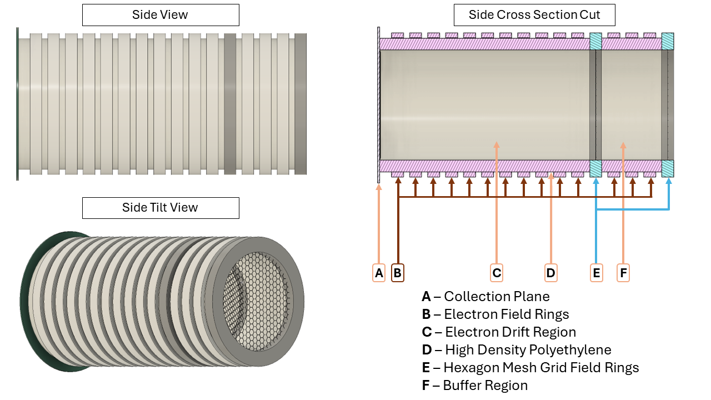
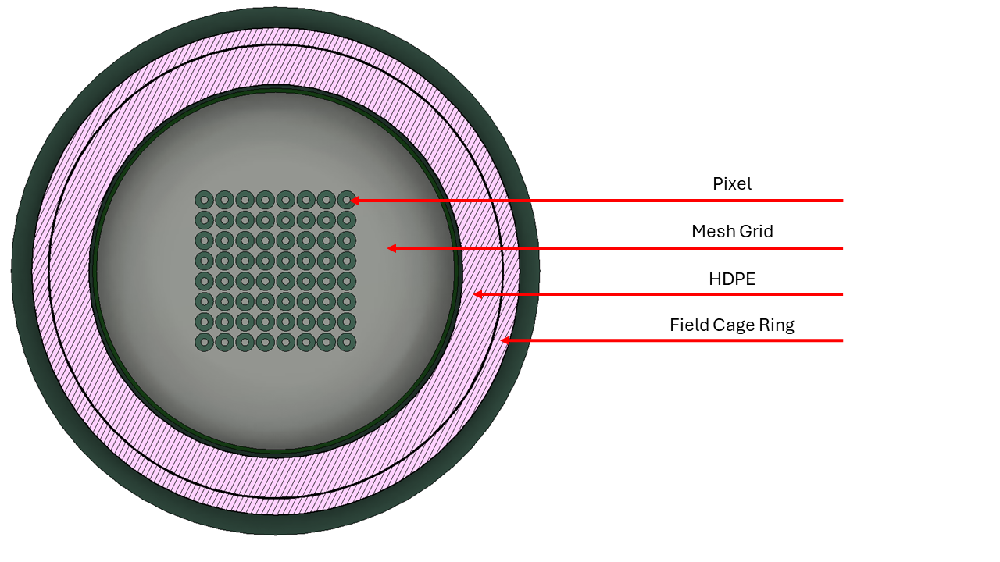

# UTAH-TPC-Simulation-and-Models

### Table of Contents
- Simplified Model
  - Contents
- Complex Model
- COMSOL Simulation (Electric Field)
- COMSOL Simulation (Particles in Free Space)

---
## Simplified Model
The simplified model is less detailed to use for initial setups on simulation

### Model Contents
The objects contained in the STEP Files are as detailed
|      Name     | Quantity |                  Description                      |
|---------------|----------|---------------------------------------------------|
| Pixel         |    64    | Charge readout input                              |
| PCB Board     |     1    | PCB Board of Pixels                               |
| Mesh          |     1    | Electric Field Mesh for field line manipulation   |
| Field Ring    |    14    | Electric Field Ring for Static Cage Environment   |
| Mesh Rings    |     2    | Electric Field Ring for Mesh Support              |
| HDPE Cylinder |     2    | Electric Field Ring for Mesh Support              |
